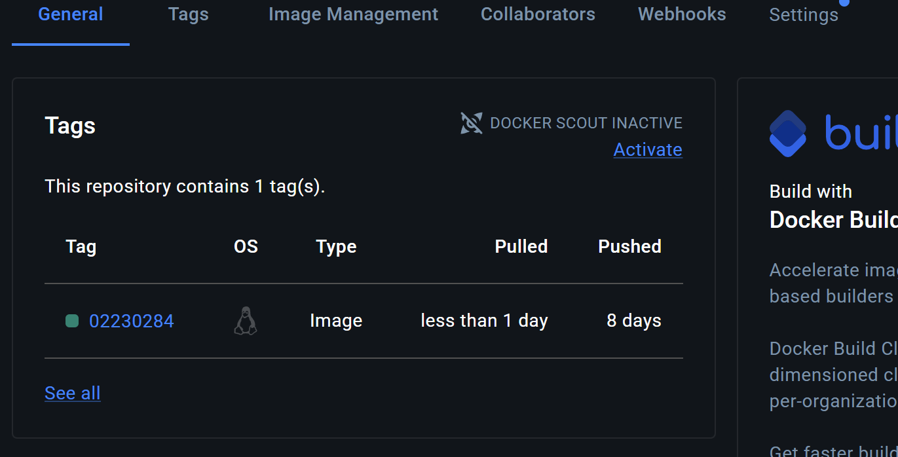
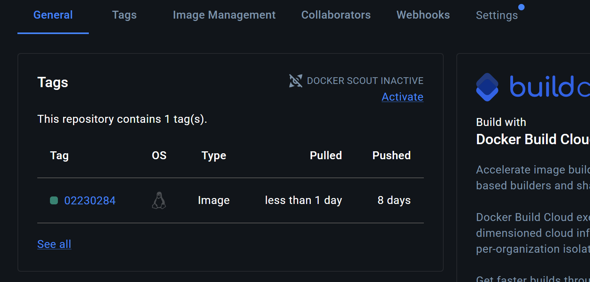
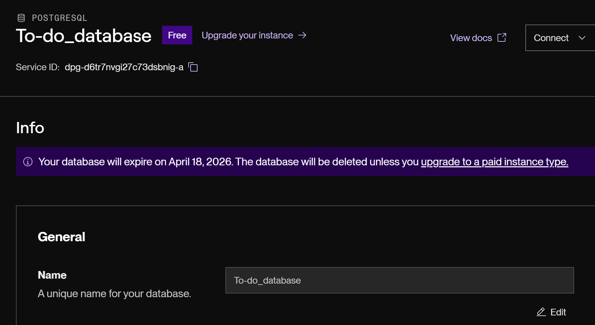
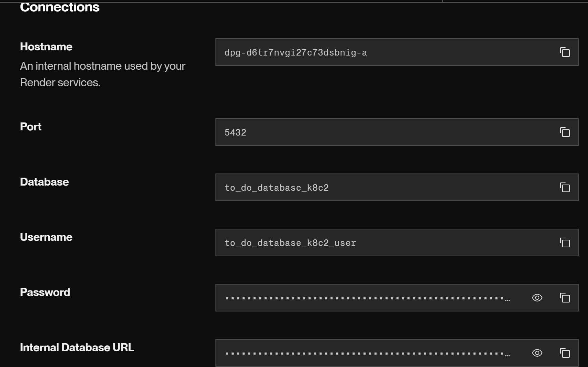
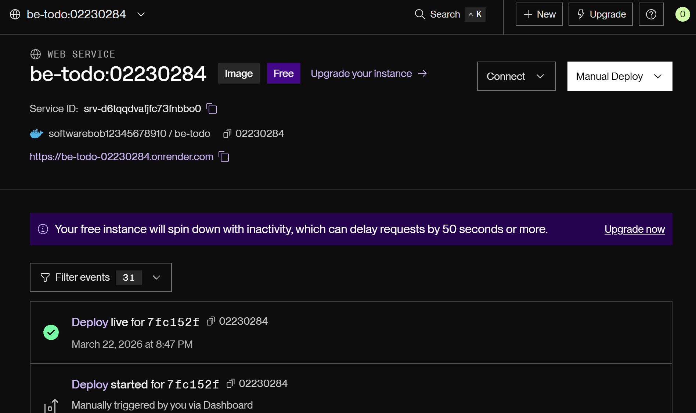
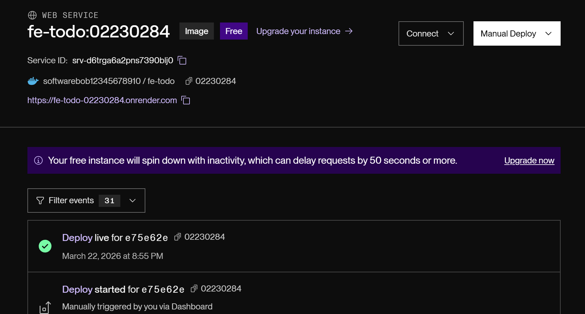
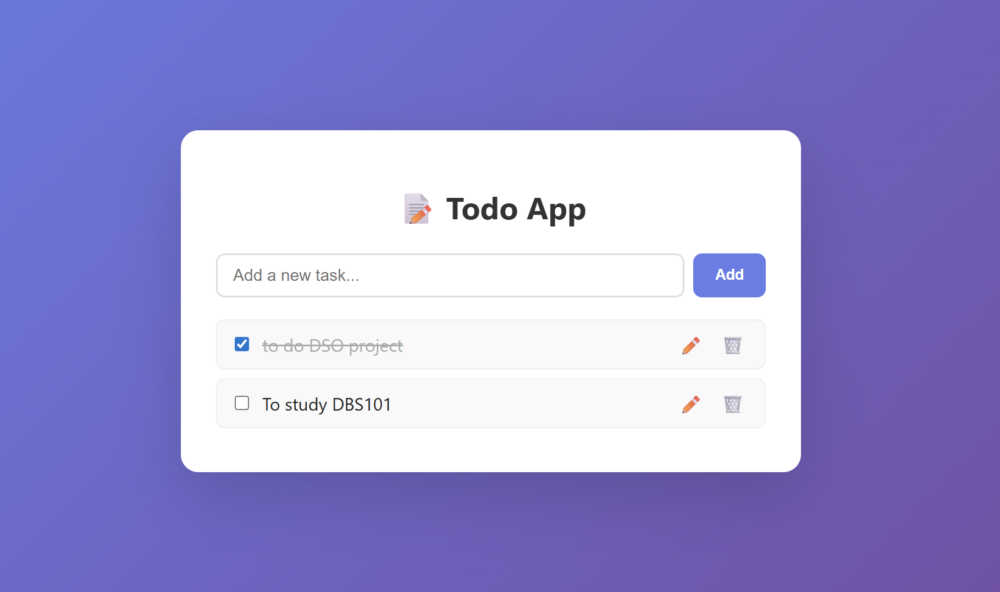
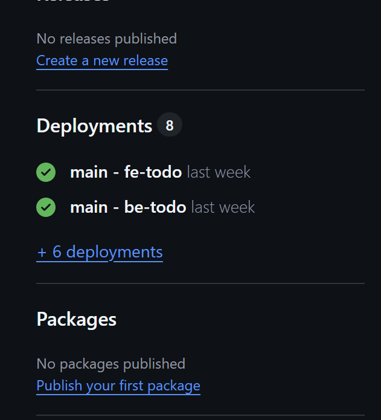

# DSO101 Assignment 1 - Todo App CI/CD
**Student Name:** [Karma Namgay Dorji]  
**Student Number:** [02230284]  
**Submission Folder:** `Karma Namgay Dorji_02230284_DSO101_A1`

---

## Project Structure

```
/todo-app
  /frontend
    Dockerfile
    nginx.conf
    .env
    .env.production
    /src
      App.js
      index.js
    /public
      index.html
    package.json
  /backend
    Dockerfile
    server.js
    .env
    package.json
  render.yaml
  docker-compose.yml
  .gitignore
  README.md
```

---

## Step 0: Prerequisites & Local Setup

### 1. Clone the repository
```bash
git clone https://github.com/SoftwareBob12345678910/DSO101_Assignment1
cd todo-app
```

### 2. Set up Backend .env
```bash
cp backend/.env backend/.env
```
Edit `backend/.env`:
```
DB_HOST=localhost
DB_USER=postgres
DB_PASSWORD=yourpassword
DB_NAME=tododb
DB_PORT=5432
DB_SSL=false
PORT=5000
```

### 3. Set up Frontend .env
```bash
cp frontend/.env frontend/.env
```
Edit `frontend/.env`:
```
REACT_APP_API_URL=http://localhost:5000
```

### 4. Run locally with Docker Compose
```bash
docker-compose up --build
```
- Frontend: http://localhost:3000
- Backend: http://localhost:5000

---

## Part A: Build & Push Docker Images to Docker Hub

### Step 1: Login to Docker Hub
```bash
docker login
```

### Step 2: Build and Push Backend Image
Replace `yourdockerhub` with your Docker Hub username, and `02190108` with YOUR student ID as the tag:
```bash
# Build backend image
docker build -t softwarebob12345678910/be-todo:02230284 ./backend

# Push to Docker Hub
docker push softwarebob12345678910/be-todo:02230284
```


### Step 3: Build and Push Frontend Image
```bash
# Build frontend image
docker build -t softwarebob12345678910/fe-todo:02230284 ./frontend

# Push to Docker Hub
docker push softwarebob12345678910/fe-todo:02230284
```


### Step 4: Deploy on Render.com

#### A. Create a PostgreSQL Database on Render
1. Go to https://render.com → Dashboard → New → PostgreSQL
2. Name it `todo-db`, click **Create Database**
3. Copy the connection details (Host, User, Password, Database name)




#### B. Deploy Backend Service
1. Go to **New → Web Service**
2. Choose **"Existing image from Docker Hub"**
3. Image: `softwarebob12345678910/be-todo:02230284`
4. Add these Environment Variables:
   ```
   DB_HOST=<your-render-db-host>
   DB_USER=<your-render-db-user>
   DB_PASSWORD=<your-render-db-password>
   DB_NAME=<your-render-db-name>
   DB_PORT=5432
   DB_SSL=true
   PORT=5000
   ```
5. Click **Deploy**




#### C. Deploy Frontend Service
1. Go to **New → Web Service**
2. Choose **"Existing image from Docker Hub"**
3. Image: `softwarebob12345678910/fe-todo:02230284`
4. Add Environment Variable:
   ```
   REACT_APP_API_URL=https://fe-todo-02230284.onrender.com/
   ```
5. Click **Deploy**




---

## Part B: Automated Build & Deployment from GitHub

In this part, Render builds a fresh Docker image every time you push a new commit to GitHub.

### Step 1: Push code to GitHub
```bash
git init
git add .
git commit -m "Initial commit - Todo App"
git remote add origin https://github.com/SoftwareBob12345678910/DSO101_Assignment1  
git push -u origin main
```

### Step 2: Connect Render to GitHub (Blueprint)
1. Go to Render Dashboard → **New → Blueprint**
2. Connect your GitHub account
3. Select your repository
4. Render will auto-detect `render.yaml` and create both services
5. Set the sensitive environment variables manually (DB credentials) in the Render dashboard

### Step 3: Update render.yaml with your actual values
In `render.yaml`, update the backend URL after your first deploy:
```yaml
- key: REACT_APP_API_URL
  value: https://be-todo-02230284.onrender.com
```

### Step 4: Test Auto-deploy
Make a small change to your code, commit and push:
```bash
git add .
git commit -m "Test auto-deploy"
git push
```
Watch Render automatically trigger a new build!


---

## Live URLs

| Service | URL |
|---------|-----|
| Frontend | https://fe-todo-02230284.onrender.com |
| Backend | https://be-todo-02230284.onrender.com |
| GitHub Repo | https://github.com/SoftwareBob12345678910/DSO101_Assignment1|
| Docker Hub (BE) | https://hub.docker.com/repository/docker/softwarebob12345678910/be-todo/general |
| Docker Hub (FE) | https://hub.docker.com/repository/docker/softwarebob12345678910/fe-todo/general |

---

## 🔑 Key Concepts Learned
- Environment variables with `.env` files
- Dockerizing a full-stack app (frontend + backend)
- Pushing Docker images to Docker Hub registry
- Deploying on Render.com using pre-built images
- Using `render.yaml` blueprint for multi-service deployment
- Auto-deploy on git push (CI/CD pipeline)
